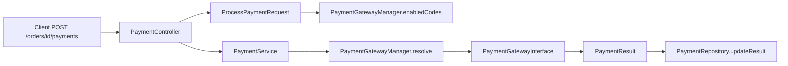

# Extendable Order and Payment Management API

Laravel REST API for managing orders and payments with JWT authentication and an extensible payment gateway strategy pattern.

**Repository:** https://github.com/Abdelrahman1203/order-payment-api

---

## Quick start (for reviewers)

```bash
git clone https://github.com/Abdelrahman1203/order-payment-api.git
cd order-payment-api
composer install
cp .env.example .env
php artisan key:generate
php artisan jwt:secret
php artisan migrate --seed
php artisan serve
```

| Item | Value |
|------|-------|
| API base URL | `http://localhost:8000/api/v1` |
| Postman collection | [`postman/Order-Payment-API.postman_collection.json`](postman/Order-Payment-API.postman_collection.json) |
| Run tests | `php artisan test` (66 tests) |
| Default DB | SQLite (`database/database.sqlite` created on migrate) |

**Suggested review flow:** Register → Login → Create order → Update status to `confirmed` → Process payment → List orders/payments.

---

## Requirements

- PHP 8.3+
- Composer
- SQLite (default local) or MySQL (Docker)
- Optional: Docker and Docker Compose

---

## Setup

### Local (SQLite)

```bash
composer install
cp .env.example .env
php artisan key:generate
php artisan jwt:secret
php artisan migrate --seed
php artisan serve
```

API base URL: `http://localhost:8000/api/v1`

> **Note:** `php artisan migrate --seed` seeds the `payment_gateways` table. Without seeding, `payment_method` validation will reject all gateways.

### Docker (MySQL)

```bash
docker compose up --build -d
docker compose exec app php artisan migrate --seed
```

Set in `.env` when using Docker:

```
DB_CONNECTION=mysql
DB_HOST=mysql
DB_PORT=3306
DB_DATABASE=order_payment
DB_USERNAME=laravel
DB_PASSWORD=secret
```

---

## Authentication

Registration and login are **public** (no token required). All order and payment endpoints require a JWT.

### Register

```http
POST /api/v1/auth/register
Content-Type: application/json

{
  "name": "Jane Doe",
  "email": "jane@example.com",
  "password": "Password1",
  "password_confirmation": "Password1"
}
```

**Response (201):** `data.user` + `data.token` (Bearer JWT).

**Password rules:** minimum 8 characters, at least one uppercase letter, one lowercase letter, and one number.

### Login

```http
POST /api/v1/auth/login
Content-Type: application/json

{
  "email": "jane@example.com",
  "password": "Password1"
}
```

**Response (200):** `data.token` + `data.token_type` (`bearer`).

### Using the token

Add to every protected request:

```
Authorization: Bearer {your-token}
```

**Rate limits:** `auth/register` and `auth/login` — 5 requests per minute per IP.

---

## API endpoints

All paths are relative to `/api/v1`.

| Method | Endpoint | Auth | Description |
|--------|----------|------|-------------|
| POST | `/auth/register` | No | Register user and receive JWT |
| POST | `/auth/login` | No | Login and receive JWT |
| GET | `/orders` | Yes | List orders (paginated, filterable) |
| POST | `/orders` | Yes | Create order |
| GET | `/orders/{id}` | Yes | View single order |
| PUT/PATCH | `/orders/{id}` | Yes | Update order (partial) |
| DELETE | `/orders/{id}` | Yes | Delete order |
| GET | `/payments` | Yes | List all user payments (paginated) |
| GET | `/orders/{id}/payments` | Yes | List payments for one order |
| POST | `/orders/{id}/payments` | Yes | Process payment |

### Query parameters

| Endpoint | Parameter | Rules | Default |
|----------|-----------|-------|---------|
| `GET /orders` | `status` | `pending`, `confirmed`, `cancelled` | — |
| `GET /orders` | `page` | integer ≥ 1 | 1 |
| `GET /orders` | `per_page` | integer 1–100 | 15 |
| `GET /payments` | `page` | integer ≥ 1 | 1 |
| `GET /payments` | `per_page` | integer 1–100 | 15 |

### Create order body

```json
{
  "customer_name": "Alice Smith",
  "customer_email": "alice@example.com",
  "items": [
    { "product_name": "Laptop", "quantity": 1, "price": 999.99 }
  ]
}
```

- `status` is optional and must be `pending` if sent (default: `pending`).
- `items` requires at least one line; `quantity` ≥ 1; `price` ≥ 0.01, max 2 decimal places.
- `total_amount` is computed server-side (do not send it).

### Process payment body

```json
{
  "payment_method": "credit_card",
  "metadata": {
    "card_number": "4111111111111111"
  }
}
```

**Allowed `payment_method` values:** `credit_card`, `paypal`, `stripe`, `bank_transfer` (must exist and be enabled in `payment_gateways`).

**Credit card:** `metadata.card_number` is **required** when `payment_method` is `credit_card`.

**Allowed metadata keys:** `card_number`, `paypal_email`, `stripe_token` (unknown keys are rejected).

---

## Order lifecycle

```
pending  →  confirmed  →  payment (successful)
   │            │
   └ cancelled   └── paid orders are locked (no further updates)
```

1. Create order (`pending`)
2. Update order status to `confirmed`
3. `POST /orders/{id}/payments` with a gateway
4. On success, order cannot be updated or paid again

---

## Business rules

| Rule | Detail |
|------|--------|
| Confirmed-only payments | Payments only for orders with status `confirmed` |
| One successful payment | `ORDER_ALREADY_PAID` if a second successful payment is attempted |
| Paid order lock | `ORDER_LOCKED` — paid orders cannot be modified via PUT/PATCH |
| Create status | New orders are always `pending` (cannot create as `confirmed`) |
| Credit card metadata | `metadata.card_number` required for `credit_card` |
| Delete guard | Orders with any payments cannot be deleted (`ORDER_HAS_PAYMENTS`, 409) |
| Server-side totals | `total_amount` calculated from line items |
| User scoping | Users only see their own orders and payments |
| Empty update | PUT/PATCH with `{}` returns 422 — at least one field required |
| Failed payments | May be retried until one succeeds |
| DB transactions | Order create/update and payment processing use transactions for multi-step writes |

---

## Error response format

All errors use a consistent envelope:

```json
{
  "error": {
    "code": "ORDER_NOT_FOUND",
    "message": "Human-readable message.",
    "details": []
  }
}
```

Validation errors include `details` with `field` and `message` per issue.

### Error codes

| Code | HTTP | When |
|------|------|------|
| `VALIDATION_FAILED` | 422 | Invalid request body or query |
| `UNAUTHENTICATED` | 401 | Missing or invalid JWT |
| `INVALID_CREDENTIALS` | 401 | Wrong email/password on login |
| `TOKEN_EXPIRED` | 401 | JWT expired |
| `TOKEN_INVALID` | 401 | Malformed JWT |
| `ORDER_NOT_FOUND` | 404 | Order missing or not owned by user |
| `ORDER_NOT_CONFIRMED` | 422 | Payment on non-confirmed order |
| `ORDER_ALREADY_PAID` | 422 | Duplicate successful payment |
| `ORDER_LOCKED` | 422 | Update on paid order |
| `ORDER_HAS_PAYMENTS` | 409 | Delete order with payments |
| `UNKNOWN_GATEWAY` | 422 | Invalid `payment_method` |
| `GATEWAY_UNAVAILABLE` | 503 | Gateway disabled or missing credentials |
| `TOO_MANY_REQUESTS` | 429 | Auth rate limit exceeded |
| `SERVER_ERROR` | 500 | Unexpected server error |

---

## Configuration

| Variable | Description |
|----------|-------------|
| `JWT_SECRET` | JWT signing secret (`php artisan jwt:secret`) |
| `JWT_TTL` | Token lifetime in minutes (default: 60) |
| `CORS_ALLOWED_ORIGINS` | Comma-separated origins (`*` for local dev) |
| `CREDIT_CARD_API_KEY` / `CREDIT_CARD_SECRET` | Credit card gateway credentials |
| `PAYPAL_CLIENT_ID` / `PAYPAL_CLIENT_SECRET` | PayPal credentials |
| `STRIPE_PUBLIC_KEY` / `STRIPE_SECRET_KEY` | Stripe credentials |
| `BANK_TRANSFER_API_KEY` / `BANK_TRANSFER_SECRET` | Bank transfer gateway credentials |

Gateway enable/disable is stored in the `payment_gateways` database table. Secrets are read from `.env` via `config/payments.php`. Both API key and secret must be set for a gateway to be available.

---

## Payment gateway extensibility (Strategy pattern)

Adding a new payment provider should not require rewriting order logic, controllers, or repositories. The API uses the **Strategy pattern**: each gateway is a swappable implementation behind a shared contract. Core payment flow stays the same; only the selected strategy changes.

### Design goal

| Without Strategy | With Strategy (this API) |
|------------------|--------------------------|
| `if/else` or `switch` on gateway code inside `PaymentService` | `PaymentService` calls `$gateway->process($context)` only |
| New gateway touches service, controller, validation | New gateway = new class + registration + config + seed row |
| Hard to test gateways in isolation | Each gateway unit-tested independently |

**Files that never change when adding a gateway:** `PaymentService`, `PaymentController`, `PaymentRepository`, routes.

### Architecture



### Core components

| Component | Path | Role |
|-----------|------|------|
| **Strategy contract** | `app/Contracts/PaymentGatewayInterface.php` | Defines `getCode()` and `process(PaymentContext): PaymentResult` |
| **Context DTO** | `app/DTOs/PaymentContext.php` | Order id, amount, customer email, metadata — passed into every gateway |
| **Result DTO** | `app/DTOs/PaymentResult.php` | Status (`successful` / `failed`), optional reference and failure reason |
| **Context (orchestrator)** | `app/Services/PaymentGatewayManager.php` | Resolves strategy by code; checks DB enablement and `.env` credentials |
| **Client** | `app/Services/PaymentService.php` | Business rules only; delegates processing to the resolved strategy |
| **Registration** | `app/Providers/PaymentServiceProvider.php` | Wires all gateway instances into the manager (single list) |
| **Runtime config** | `config/payments.php` + `payment_gateways` table | Credentials from `.env`; enable/disable per gateway in DB |
| **Validation** | `app/Http/Requests/Api/V1/ProcessPaymentRequest.php` | `payment_method` allowed values loaded dynamically from enabled DB codes |

### Strategy contract

```php
interface PaymentGatewayInterface
{
    public function getCode(): string;

    public function process(PaymentContext $context): PaymentResult;
}
```

Each gateway class lives in `app/PaymentGateways/` and contains **only** that provider’s processing rules.

### End-to-end integration flow

When a client calls `POST /api/v1/orders/{id}/payments`:

1. **Validate** — `ProcessPaymentRequest` checks `payment_method` against `PaymentGatewayManager::enabledCodes()` (from `payment_gateways` where `is_enabled = true`).
2. **Business rules** — `PaymentService` ensures the order is `confirmed`, not already paid, and owned by the user.
3. **Resolve strategy** — `PaymentGatewayManager::resolve($paymentMethod)` finds the implementation, verifies the gateway is enabled, and confirms API key + secret exist in config.
4. **Create pending payment** — `PaymentRepository` stores a `pending` payment record.
5. **Execute strategy** — `$gateway->process(new PaymentContext(...))` runs provider-specific logic (simulated).
6. **Persist result** — Repository updates the payment to `successful` or `failed` with gateway reference or failure reason.

`PaymentService` never branches on gateway name — it only calls the interface.

### Built-in gateways

| Code | Class | Simulated behavior |
|------|-------|-------------------|
| `credit_card` | `CreditCardGateway` | Succeeds unless card `4111111111111111` and amount > 1000 |
| `paypal` | `PayPalGateway` | Fails if customer email contains `fail@` |
| `stripe` | `StripeGateway` | Fails if order total ends in `.99` |
| `bank_transfer` | `BankTransferGateway` | Requires API key + secret; fails if customer email contains `hold@` |

### Example integration: `bank_transfer`

This gateway was added following the extensibility steps — no changes to `PaymentService` or controllers.

**1. Strategy class** (`app/PaymentGateways/BankTransferGateway.php`)

```php
class BankTransferGateway implements PaymentGatewayInterface
{
    public function getCode(): string
    {
        return 'bank_transfer';
    }

    public function process(PaymentContext $context): PaymentResult
    {
        // Credential check + simulated hold/fail logic
        return new PaymentResult(PaymentStatus::Successful, 'bt_'.Str::uuid());
    }
}
```

**2. Register in provider** (`app/Providers/PaymentServiceProvider.php`)

```php
return new PaymentGatewayManager([
    new BankTransferGateway,
    new CreditCardGateway,
    // ...
]);
```

**3. Map credentials** (`config/payments.php` + `.env.example`)

```php
'bank_transfer' => [
    'env_prefix' => 'BANK_TRANSFER',
    'api_key' => env('BANK_TRANSFER_API_KEY'),
    'secret' => env('BANK_TRANSFER_SECRET'),
],
```

**4. Seed DB row** (`database/seeders/PaymentGatewaySeeder.php`)

```php
['code' => 'bank_transfer', 'name' => 'Bank Transfer', 'config_key' => 'BANK_TRANSFER'],
```

After `php artisan migrate --seed`, `payment_method: bank_transfer` is accepted automatically via `enabledCodes()`.

**5. Unit tests** (`tests/Unit/PaymentGateways/BankTransferGatewayTest.php`) — success, failure, and missing-credentials cases.

### Adding any new gateway (checklist)

| Step | Action | Touches core payment flow? |
|------|--------|----------------------------|
| 1 | Create `app/PaymentGateways/YourGateway.php` implementing `PaymentGatewayInterface` | No |
| 2 | Add one line to `PaymentServiceProvider` gateway array | No |
| 3 | Add credentials block to `config/payments.php` and `.env.example` | No |
| 4 | Add row to `PaymentGatewaySeeder` and run seed | No |
| 5 | Add unit test under `tests/Unit/PaymentGateways/` | No |
| 6 | (Optional) Add gateway-specific metadata rules in `ProcessPaymentRequest` if needed | Validation only |

**Optional metadata:** Gateway-specific fields (e.g. `metadata.card_number` for credit card) are validated in `ProcessPaymentRequest` — add rules there only when a new gateway needs extra client input.

### Credential and availability rules

`PaymentGatewayManager` enforces availability before calling `process()`:

- Gateway code must be registered in `PaymentServiceProvider`.
- Row must exist in `payment_gateways` with `is_enabled = true`.
- If `env_prefix` is set in `config/payments.php`, both `api_key` and `secret` must be non-empty.

Failures return `UNKNOWN_GATEWAY` (422) or `GATEWAY_UNAVAILABLE` (503) without entering gateway logic.

---

## Postman collection

Import [`postman/Order-Payment-API.postman_collection.json`](postman/Order-Payment-API.postman_collection.json).

**Collection variables:**

| Variable | Example |
|----------|---------|
| `base_url` | `http://localhost:8000/api/v1` |
| `token` | Set automatically after Register/Login success scripts |
| `order_id` | Set automatically after Create Order |

**Folders:** Auth, Orders, Payments, Common Errors — includes success and error examples for validation, auth, business rules, and rate limiting.

---

## Architecture

```
routes → controllers → form requests → services → repositories → models
                              ↓
                    PaymentGatewayManager → PaymentGatewayInterface
```

| Layer | Role |
|-------|------|
| Controllers | HTTP transport only; delegate to services |
| Form Requests | Input validation at the API boundary |
| Services | Business rules (confirmed-order check, paid lock, delete guard) |
| Repositories | Data access, eager loading, pagination |
| API Resources | Stable response shape (decoupled from Eloquent) |
| Payment gateways | Strategy implementations behind `PaymentGatewayInterface` (see [Payment gateway extensibility](#payment-gateway-extensibility-strategy-pattern)) |

Paginated list responses use a custom collection wrapper so `links` and `meta` never contain `null` arrays.

---

## Security

- **Rate limits:** `auth/login` and `auth/register` — 5 requests/minute per IP.
- **Input validation:** All body and query parameters validated via Form Requests; unknown payment metadata keys rejected.
- **SQL safety:** Eloquent parameterized queries only (no raw SQL with user input).
- **HTTP headers:** `X-Content-Type-Options`, `X-Frame-Options`, `Referrer-Policy`, `Cache-Control: no-store`.
- **CORS:** Configure via `CORS_ALLOWED_ORIGINS`.
- **Production:** Set `APP_DEBUG=false`, use a strong `JWT_SECRET`, restrict CORS to trusted frontends.

---

## Testing

```bash
php artisan test
```

**66 tests** covering:

- Auth (register, login, validation, rate limiting)
- Orders (CRUD, validation, paid-order lock, empty update)
- Payments (gateways, duplicate payment, card number required)
- Security (headers, CORS, unauthenticated access)
- Unit tests for gateways, manager, and services

---

## Assumptions

- Payment processing is **simulated** (no real Stripe/PayPal/bank API calls).
- Each payment is briefly `pending`, then updated synchronously to `successful` or `failed`.
- Multiple failed payment attempts are allowed; clients may retry until success.
- Orders must be explicitly updated to `confirmed` before payment.
- Default local setup uses SQLite; Docker setup uses MySQL.

---

## License

MIT
